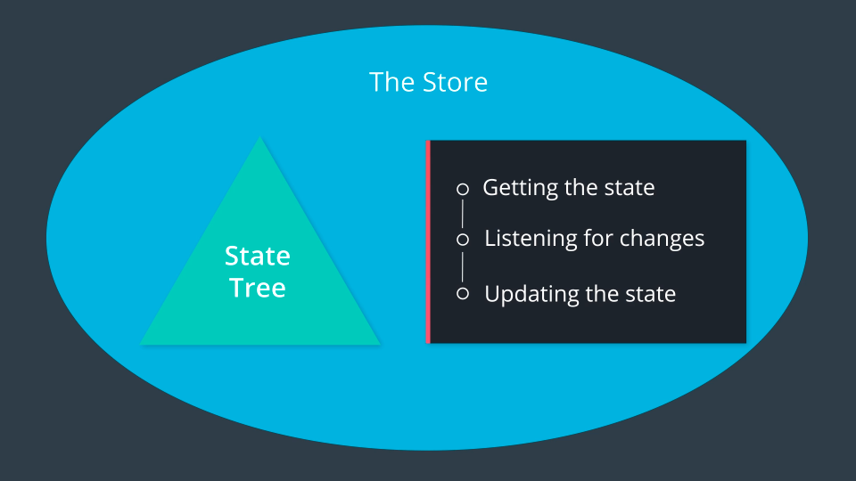

# [React & Redux](https://classroom.udacity.com/nanodegrees/nd019/parts/7dab5516-d1ae-45d3-b8f8-d782b5534caf)

## Schedule as a Mentor

### Week #4 4/8/2019: 5 horas 12 minutos

- Managing State
- UI + Redux
- Redux Middleware

--> Webinar Content: Redux cycle overview (actions/reducers/store relationship)

### Week #5 4/15/2019: 5 horas

- Redux with React
- Asynchronous Redux

--> Webinar Content: Redux Developer Tools (Chrome extension)

### Week #6 4/22/2019: 9 horas y media

- react-redux
- Real World Redux

--> Webinar Content: Redux store (state) vs. React component state

### Week #7 4/29/2019:

- Project 2: Would You Rather?

--> Webinar Content: Redux middleware overview

### Week #8 5/6/2019:

- Project 2: Would You Rather?

--> Webinar Content: react-redux: connect() and <Provider/>

### Week #9 5/13/2019

- Project 2: Would You Rather?

--> Webinar Content: Presentational vs. container components

### Week #10 5/20/2019:

- Project 2: Would You Rather?

--> Webinar Content:Redux and asynchronicity (thunk middleware)

### Week #11 5/27/2019:

- Project 2: Would You Rather?

--> Webinar Content: Normalizing state shape in Redux

## Lesson 1: Managing State (1h 30min)

You’ll learn techniques to make your state more predictable by moving your state to a central location and establishing strict rules for getting, listening, and updating that state.

### The Store

Gole of Redux: "Make the state of our app more predictable"

State tree: Where all our app data is stored. Represented as a triangle.
How we interact with it? - Get state - Listen for changes - Update state

This 3 things+ State tree are called _the store_

Now we are going to create the store by ourselves from scratch (create a factory function that creates store objects.)

Actions:

```
{
type: "ADD_ITEM"
}
```

Action Creators are functions that create/return action objects. For example:

```
const addItem = item => ({
  type: ADD_ITEM,
  item
});

```

Pure functions are integral to how state in Redux applications is updated. By definition, pure functions:

- Return the same result if the same arguments are passed in
- Depend solely on the arguments passed into them
- Do not produce side effects, such as API requests and I/O operations

Rules for updating state:

- Only an event (actions) can change the state of the store.
- The function that returns the new state needs to be a pure function.

Reducers: Pure functions

for updating the store we need the dispatch function...



We've finally finished creating the createStore function! Using the image above as a guide, let's break down what we've accomplished:

we created a function called createStore() that returns a store object
createStore() must be passed a "reducer" function when invoked
the store object has three methods on it:
.getState() - used to get the current state from the store
.subscribe() - used to provide a listener function the store will call when the state changes
.dispatch() - used to make changes to the store's state
the store object's methods have access to the state of the store via closure

#### Ideas for webinar: When to use Redux ...

## Lesson 2: UI + Redux (1h 12min)

You’ll learn to move away from having state live in the DOM by creating a vanilla JavaScript application whose state is managed entirely by Redux.

## Lesson 3: Redux Middleware (2h 30min)

You’ll learn to create custom middleware and add it to your Redux store. This middleware will allow you to enhance your store by hooking into and intercepting actions before they reach any reducers.

We've seen the Store, Actions and the reducers, yeah! The Middleware will let us hook into lifecycle events.

Feature: If the todo app has a bitcoin word tell that that is a bad idea, Tyler introduces the concept: checkAndDispatch(), but we had to change the code of our app, with Middleware
we would be able to add this kind of behaviour without changing the app code:

```
…a third-party extension point between dispatching an action, and the moment it reaches the reducer.
```

What's great about middleware is that once it receives the action, it can carry out a number of operations, including:

- producing a side effect (e.g., logging information about the store)
- processing the action itself (e.g., making an asynchronous HTTP request)
- redirecting the action (e.g., to another piece of middleware)
- dispatching supplementary actions

Now we just can apply our new `checker` app with a 2nd argument to the createStore:

```
const store = Redux.createStore(
  Redux.combineReducers({
    todos,
    goals
  }), Redux.applyMiddleware(checker)
);
```

## Lesson 4: Redux with React (2h 30min)

You’ll learn how to add React to a Redux application and have the state of that application be managed by Redux.

## Lesson 5: Asynchronous Redux (2h 30min)

You’ll learn to better abstract asynchronous events by creating your own custom Thunk middleware and adding it to your store.

## Lesson 6: react-redux (2h)

You’ll learn to leverage the react-redux bindings in order to leverage the benefits of a UI library like React and a state management library like Redux.

## Lesson 7: Real World Redux (7h 30min)

You’ll take your knowledge of Redux and utilize it by building a real world Redux application. You’ll also learn advanced Redux topics like reducer composition and normalization.

## Lesson 8: Project: Would you Rather?
