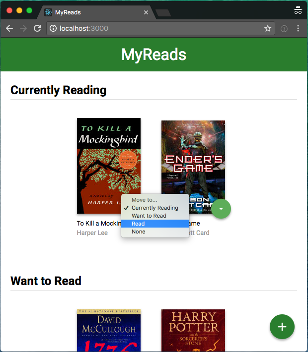

# MyReads: A Book Tracking App

## App Functionality

In this application, the main page displays a list of "shelves" (i.e. categories), each of which contains a number of books. The three shelves are:

Currently Reading
Want to Read
Read

Each book has a control that lets you select the shelf for that book. When you select a different shelf, the book moves there. Note that the default value for the control should always be the current shelf the book is in.

The main page also has a link to /search, a search page that allows you to find books to add to your library.

The search page has a text input that may be used to find books. As the value of the text input changes, the books that match that query are displayed on the page, along with a control that lets you add the book to your library. To keep the interface consistent, you may consider re-using some of the code you used to display the books on the main page.

When a book is on a bookshelf, it should have the same state on both the main application page and the search page.

The search page also has a link to / (the root URL), which leads back to the main page.

When you navigate back to the main page from the search page, you should instantly see all of the selections you made on the search page in your library.

Extra functionality:

- rate the books
- bulk move from the selfs
- pagination?
- styles?

## How to build it

### Aproaching a Project

Draw the app, think where the state is, think on the components upfront

- Project Overview

In the MyReads project, you'll create a bookshelf app that allows you to select and categorize books you have read, are currently reading, or want to read. The project emphasizes using React to build the application and provides an API server and client library that you will use to persist information as you interact with the application.

- Get the Project
  You have a few options to start developing this project:
  using your preconfigured Workspace
  forking and cloning the [start repository](https://github.com/udacity/reactnd-project-myreads-starter)
  starting from scratch with [Create React App](https://github.com/facebookincubator/create-react-app)
