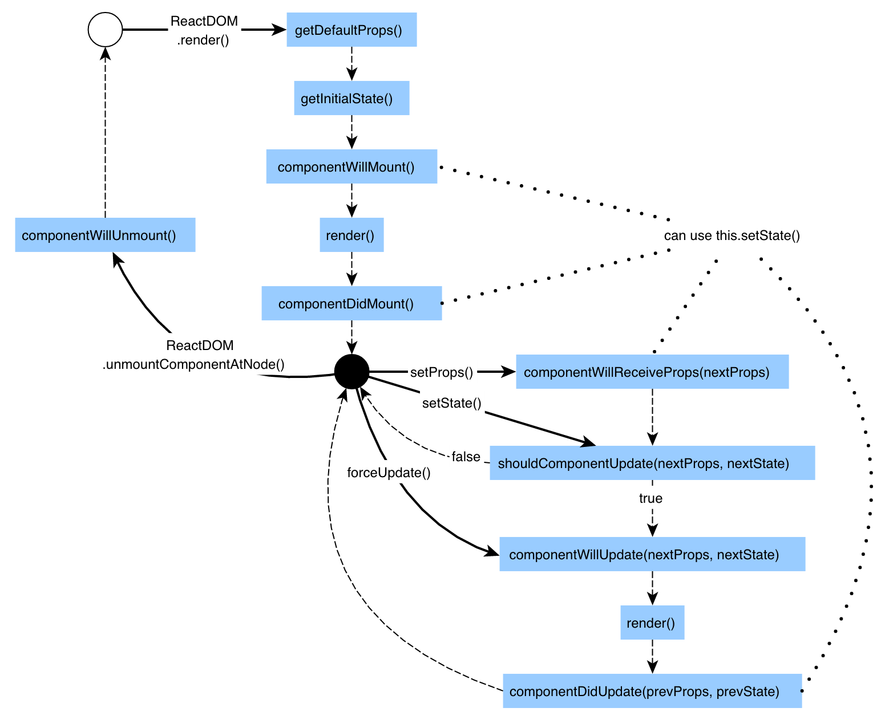

# Lyfecicle events

Example app to go through lyficle events and see them:

We shouldnt use a db fetch inside the render method, render method sould be free of sideeffects ...

- ComponentDidMount:
  Invoked inmediatly after the component is inserted into the DOM. Setting state in this method will trigger a re-rendering
- ComponentWillUnMount:
  Invoked inmediatly before the component is removed from the DOM
- getDerivedStateFromProps:
  Invoked after a component is instantiated as well as when it receives brand new props
- shouldComponentUpdate()
  You'll sometimes see in React apps as well. It returns true by default. This means that whenever a component's state (or its parent's state) is updated, the component re-renders

Consider using the built-in PureComponent instead of writing shouldComponentUpdate() by hand.
If your React component’s render() function renders the same result given the same props and state, you can use [React.PureComponent](https://reactjs.org/docs/react-api.html#reactpurecomponent) for a performance boost in some cases

Life cycle events part: https://classroom.udacity.com/nanodegrees/nd019/parts/57812373-5147-4152-a4f7-d2e164aba8a5/modules/7778e6bd-7868-47d0-8536-cfcbe4e29f19/lessons/a34ba863-12fd-4c7b-8062-a9881ebdb763/concepts/99997308-de29-4709-be62-3b7c38b780c3

https://reactjs.org/docs/react-component.html#the-component-lifecycle

Adding to the DOM
These lifecycle events are called when a component is being added to the DOM:

constructor()
componentWillMount()
render()
componentDidMount()
Re-rendering
These lifecycle events are called when a component is re-rendered to the DOM

componentWillReceiveProps()
shouldComponentUpdate()
componentWillUpdate()
render()
componentDidUpdate()
Removing from the DOM
This lifecycle event is called when a component is being removed from the DOM

componentWillUnmount()

https://reactjs.org/docs/react-component.html#the-component-lifecycle

http://projects.wojtekmaj.pl/react-lifecycle-methods-diagram/

Error Handling
These methods are called when there is an error during rendering, in a lifecycle method, or in the constructor of any child component.

static getDerivedStateFromError()
componentDidCatch()
