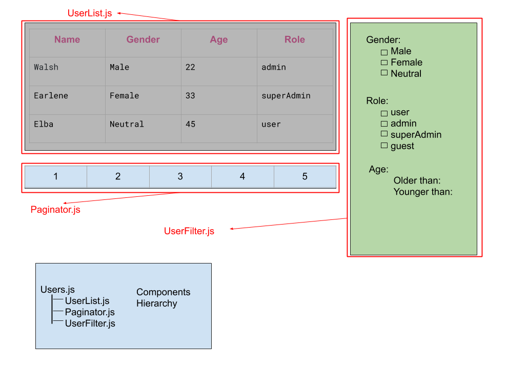

This project is a quick example for Thinking in React way for building an application.
I wanted to focus on a real world problem like a list wich has filters and pagination.

[Official doc](https://reactjs.org/docs/thinking-in-react.html)

Step 1: Break The UI Into A Component Hierarchy

Here you have step 1 diagram:

